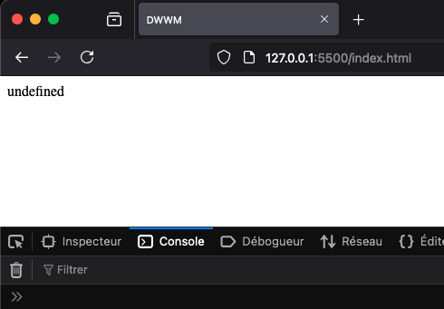

# Déclaration de variable

Une variable n’est, finalement, qu’une valeur, définie par un nom, stockée en mémoire. La déclaration d’une variable est extrêmement simple. Il suffit d’écrire son nom précédé du mot-clé `let`.

Par convention, le nom d’une variable respecte le format camelCase (littéralement, casse du chameau). Cette méthode de nommage est très utilisée en programmation. Elle consiste à lier des mots sans espace en mettant en lettre capitale la première lettre de chaque mot. PlayStation et MasterCard sont des exemples de l’utilisation du camelCase dans la vie courante même si les développeurs préfèrent utiliser une minuscule à la toute première lettre pour ne pas confondre une variable avec une classe ou un objet.

> Auparavant, c’est le mot-clé `var` qui était utilisé, mais sa portée lexicale était source d’erreurs. En effet, `var` pouvait être utilisé dans l’espace global.

Une variable peut donc être déclarée sans aucun type.

```html
<!DOCTYPE html>
<html lang="fr">
  <head>
    <meta charset="UTF-8" />
    <title>Formation DWWM</title>
  </head>
  <body>
    <script>
      // Déclaration de variable sans type
      let leNomDeMaVariable;
    </script>
  </body>
</html>
```

JavaScript est sensible à la casse, ce qui signifie que les variables `maVariable`, `MaVariable` et `maVaRiAbLe` sont bien trois variables différentes.

L’opérateur `typeof` permet de connaître précisément le type d’une variable.

```js
typeof expression
```

`expression` étant la variable dont on souhaite connaître le type.

```
<!DOCTYPE html>
<html lang="fr">
  <head>
    <meta charset="UTF-8" />
    <title>Formation DWWM</title>
  </head>
  <body>
    <div id="resultat"></div>
    <script>
      // Utilisation de l'opérateur typeof
      let maVariable01;
      document.getElementById('resultat').innerHTML = typeof maVariable01;
    </script>
  </body>
</html>
```

Remarquez l’utilisation de `document.getElementById('resultat').innerHTML` afin de permettre l’affichage du code JavaScript dans le document HTML.

Ici, aucune valeur n’a été affectée à `maVariable01` pendant sa déclaration. En l’absence d’indication, son type est non défini, donc `undefined`.



Type d’une donnée sans type défini

Lorsque la valeur initiale de la variable est connue, on peut l’affecter grâce à l’opérateur \=.

```html
<!DOCTYPE html>
<html lang="fr">
  <head>
    <meta charset="UTF-8" />
    <title>Formation DWWM</title>
  </head>
  <body>
    <div id="resultat"></div>
    <script>
      // Affectation à l'initialisation
      let maVariable02 = ' <p>Formation DWWM</p>';
      document.getElementById('resultat').innerHTML = maVariable02;
    </script>
  </body>
</html>
```

En une seule ligne, la variable nommée `maVariable02` est déclarée en tant que chaîne de caractères et contient la valeur `Formation DWWM`.

Une variable peut être utilisée comme valeur d’initialisation d’une autre variable.

```js
let ecole = 42; 
let inodeRoot = ecole;
```

En lisant de droite à gauche, sur la seconde ligne, on comprend que la valeur de la variable `ecole` est affectée à la variable `inodeRoot`. Elle est de type nombre et sa valeur est 42.

Les deux variables ne sont absolument pas liées. Si la valeur de la variable `ecole` est incrémentée, celle de `inoderoot` reste à 42.
