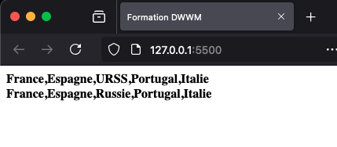

# Tableaux Tableau

## 1\. Déclaration et initialisation

Un tableau permet de stocker plusieurs variables, de différentes natures ou non, dans une seule. Sa taille n’est pas fixée et elle peut évoluer au fur et à mesure de l’exécution du programme.

C’est une suite de valeurs séparées par des virgules, entourée par deux crochets.

```js
let monTableau = [ uneValeur, uneDeuxieme, uneTroisieme];
```

Les valeurs contenues dans le tableau peuvent être de type différent.

```js
let listeDeCourses = ["soja", "carottes", "maïs"];
```

Un tableau peut contenir un ou plusieurs autres tableaux. On parle alors de tableaux multidimensionnel.

Par exemple, pour stocker une liste de courses en mémoire, les aliments et la quantité désirée doivent être stockés dans des tableaux. La liste n’est finalement qu’un tableau qui contient d’autres tableaux.

```js
let listeDeCourses = [
  ["carottes", 2],
  ["pommes", 5],
  ["pamplemousse", 1],
  ["courgettes", 1]
];
```

## 2\. Accès

Chaque élément du tableau est indicé. En JavaScript, comme très souvent en informatique, le premier élément porte l’indice 0. Un indice est toujours un nombre entier.

```js
let chiens = ["Akamaru", "Diabolo", "Scooby", "Mirza", "Paf"];

// chiens[0] vaut 'Diabolo'.
// chiens[3] vaut 'Mirza'. D'ailleurs, l'avez-vous vu ?
```

Si le développeur essaye d’accéder à un indice de tableau qui n’existe pas, la valeur sera `undefined`.

Concernant les tableaux multidimensionnels, les indices doivent se succéder pour accéder à la valeur désirée : `tableauxDeTableaux[0][1][1][3]`.

## 3\. Modification

Chaque élément d’un tableau peut être modifié simplement en utilisant l’opérateur `=` et son indice.

```html
<!DOCTYPE html>
<html lang="fr">
  <head>
    <meta charset="UTF-8" />
    <title>Formation DWWM</title>
  </head>
  <body>
    <div id="resultat1"></div>
    <div id="resultat2"></div>
    <script>
      let europe = ['France', 'Espagne', 'URSS', 'Portugal', 'Italie'];
      document.getElementById('resultat1').innerHTML = '<strong>' + europe + '</strong><br>';
      europe[2] = 'Russie';
      document.getElementById('resultat2').innerHTML = '<strong>' + europe + '</strong><br>';
    </script>
  </body>
</html>
```



Modification d’un élément d’un tableau

## 4\. Fonctions utiles

### a. push et unshift

Les fonctions `push()` et `unshift()` ajoutent, toutes deux, un ou plusieurs éléments à un tableau. La seule différence entre ces deux fonctions concerne le lieu d’action.

`push()` ajoute en fin de tableau alors que `unshift()` ajoute au début.

```js
let monTableau = [valeur1, valeur2];
monTableau.push(valeur3);
monTableau.unshift(valeur0);
```

```html
<!DOCTYPE html>
<html lang="fr">
  <head>
    <meta charset="UTF-8" />
    <title>Formation DWWM</title>
  </head>
  <body>
    <script>
      let starCraft2 = ['Raynor', 'Kerrigan'];
       starCraft2.push('Nova', 'Stukov');
       console.log(starCraft2) // [ "Raynor", "Kerrigan", "Nova", "Stukov" ]

       starCraft2.unshift('Tycchus');
       console.log(starCraft2) // [ "Tycchus", "Raynor", "Kerrigan", "Nova", "Stukov" ]
    </script>
  </body>
</html>
```

### b. pop et shift

Ces deux fonctions sont l’exact opposé de `pop` et `unshift`. Au lieu d’ajouter, elles retirent un et un seul élément.

```js
let monTableau = [valeur1, valeur2];
monTableau.pop(valeur2);
monTableau.shift(valeur1);
```

```html
<!DOCTYPE html>
<html lang="fr">
  <head>
    <meta charset="UTF-8" />
    <title>Formation DWWM</title>
  </head>
  <body>
    <script>
      let warCraft3 = ['Ragnaros', 'Maiev', 'Medivh', 'Thrall', 'Sylvanas'];
      warCraft3.pop(); // On retire Sylvanas
      warCraft3.pop(); // On retire Thrall
      warCraft3.shift(); // On retire Ragnaros
    </script>
  </body>
</html>
```

### c. indexOf

La fonction `indexOf()` permet de connaître l’indice d’un élément dans un tableau. Si l’élément est présent plusieurs fois, alors cette fonction ne renverra que la première occurrence. S’il n’est pas présent du tout, elle renverra -1.

```js
let monTableau = [valeur1, valeur2];
monTableau.indexOf(valeur2);
```
