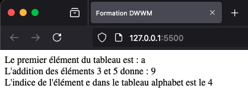

# Mise en pratique

## Énoncé

La page HTML ci-après a initialisé un tableau de chiffres et de lettres.

```html
<!DOCTYPE html>
<html lang="fr">
  <head>
    <meta charset="UTF-8" />
    <title>Formation DWWM</title>
  </head>
  <body>
    <script>
      let tableau = [
        'a', 'b', 6, 'd', 3, 'b', 99, 'e', 6, 'e', 'c', 15, 'f', 8, 'b', 6, 'f'
        , 5, 'b', 338576, 'f', 0o57, 'e'];
    </script>
  </body>
</html>
```

- Affichez son premier élément grâce à JavaScript et à la méthode `document.write().`

- Additionnez son troisième et cinquième élément et affichez le résultat.

- Créez un nouveau tableau appelé `alphabet` qui contient toutes les lettres de l’alphabet. Récupérez le huitième élément du tableau `tableau` et recherchez-le dans le tableau `alphabet`. Affichez son indice.




_Résultat attendu de la mise en pratique_
