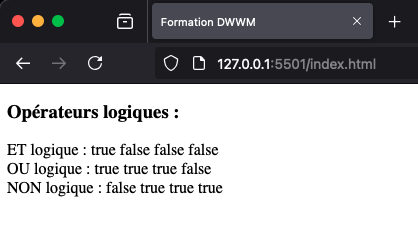
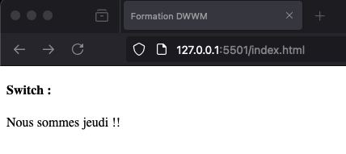

# Conditions

## 1\. Opérateurs logiques

L’algèbre de Boole, aussi appelé calcul booléen, permet d’évaluer des expressions mathématiques à deux valeurs. Classiquement, les opérateurs logiques sont utilisés entre deux booléens pour renvoyer un booléen résultat de l’opération. Dans de rares cas, ils permettent le retour de valeurs non booléennes.

### a. ET

Le ET logique (`&&`) renvoie vrai si, et seulement si, les deux expressions évaluées renvoient vrai.

```js
document.writeln(true && true);   // vrai 
document.writeln(true && false);  // faux 
document.writeln(false && true);  // faux 
document.writeln(false && false); // faux
```

### b. OU

Il suffit au OU logique (`||`) qu’un seul élément soit vrai pour retourner vrai.

```js
document.writeln(true || true);   // vrai 
document.writeln(true || false);  // faux 
document.writeln(false || true);  // faux 
document.writeln(false || false); // faux
```

### c. NON

Bien que la négation ne se fasse que sur une seule expression, elle peut, néanmoins, être considérée comme un opérateur logique.

`null`, le chiffre 0 et la chaîne de caractères vide sont évalués à `false`. Leur négation retourne donc vrai.

```js
document.writeln(!true) 
document.writeln(!false) 
document.writeln(!null) 
document.writeln(!0)
```

### d. Évaluation

Puisque le ET logique ne renvoie vrai que lorsque les deux expressions sont vraies, JavaScript n’évalue pas la deuxième expression si la première est fausse.

De la même façon, il n’évalue pas la deuxième expression d’un OU logique si la première est vraie.

```html
<!DOCTYPE html>
<html lang="fr">
  <head>
    <meta charset="UTF-8" />
    <title>Formation DWWM</title>
  </head>
  <body>
    <div id="resultat"></div>
    <script>
      // Opérateurs logiques
      document.writeln("<h3>Opérateurs logiques : </h3>");
      // Et
      document.writeln('<span>ET logique : </span>');
      document.writeln(true && true); // vrai
      document.writeln(true && false); // faux
      document.writeln(false && true); // faux
      document.writeln(false && false); // faux
      document.writeln('<br />');
      // Ou
      document.writeln('<span>OU logique : </span>');
      document.writeln(true || true); // vrai
      document.writeln(true || false); // faux
      document.writeln(false || true); // faux
      document.writeln(false || false); // faux
      document.writeln('<br />');
      // Non
      document.writeln('<span>NON logique : </span>');
      document.writeln(!true);
      document.writeln(!false);
      document.writeln(!null);
      document.writeln(!0);
      document.writeln('<br />');
    </script>
  </body>
</html>
```



Démonstration des opérateurs logiques

### e. Priorité des opérations

La priorité en mathématiques est la façon dont les opérateurs réagissent lorsque plusieurs calculs sont à évaluer dans une opération complexe.

En algèbre classique, la multiplication et la division l’emportent sur l’addition et la soustraction de sorte que 2 + 3 \* 5 = 17, et non 25.

Dans l’algèbre de Boole, le `&&` est appliqué avant le `||`. Bien entendu, cela peut être modifié grâce aux parenthèses.

```js
document.writeln(true || false && false);   // vrai 
// false && false est évalué en premier 
document.writeln((true || false) && false); // faux 
// la priorité a été modifiée par les parenthèses 
// true || false est évalué en premier
```

## 2\. Syntaxe

### a. if

L’instruction de condition n’effectuera le bloc d’instructions que si le test retourne vrai.

```js
if (test) { 
   opération(s); 
}
```

Le test peut être un booléen, une opération mathématique traditionnelle ou une opération logique.

```js
// Avec une opération mathématique :
let age = 18;
if (age >= 18) {
  document.writeln("Cette personne est majeure");
}
// Avec un booléen :
let majeur = true;
if (majeur) {
  document.writeln("Cette personne est majeure");
}
// Avec une opération logique :
if (true || false) {
  document.writeln("le test retourne vrai");
}
```

### b. if... else

Si jamais le développeur souhaite évaluer une expression et effectuer un bloc si elle est vraie et un autre si elle est fausse, un bloc supplémentaire d’instructions doit être ajouté.

```js
if (test) {
  opération(s) si vrai;
else {
    opération(s) si faux;
}
```

Dans l’exemple précédent, si la personne n’est pas majeure, a priori, elle est mineure. 

```js
let age = 18;
if (age >= 18) {
  document.writeln("majeur");
} else {
  document.writeln("mineur");
}
```

De plus, chaque condition peut contenir une autre condition :

```js
let age = 18;

if (age >= 18) {
  document.writeln("majeur");
} else if (age >= 14) {
  document.writeln("adolescent");
} else {
  document.writeln("enfant");
}
```

### c. Opérateur ternaire

L’utilisation d’une condition pour évaluer une expression et agir en fonction du retour est relativement courante en programmation. Les développeurs ont donc prévu une façon plus élégante et rapide d’écrire une condition simple.

```js
condition ? opération si vrai : opération si faux;
```

Savoir si une personne est majeure ou mineure peut donc s’écrire en une seule ligne.

```js
let age = 18; 
document.writeln((age > 18 ? "majeur" : "mineur"));
```

### d. switch

`switch` permet de tester une expression et d’exécuter la ou les opérations qui correspondent aux critères sélectionnés.

```
switch (expression à évaluer) {
    case 'conditions' :
        opération(s) à effectuer;
    case 'une autre condition':
        opération(s) à effectuer;
    default:
        opération(s) à effectuer;
}
```

`switch` compare le résultat d’une et une seule expression à de multiples valeurs. 

Le mot-clé `break` permet de sortir du bloc d’instructions `switch`. Il est souvent placé en fin d’opération de chaque `case` du `switch` afin que le reste des évaluations ne soit pas effectué une fois la première correspondance trouvée.

La méthode `getDay()` de la classe `Date` permet de retourner le chiffre correspondant au jour de la semaine. Le chapitre JavaScript orienté objet est consacré aux classes et aux méthodes. Grâce au `switch`, l’application indique le jour de la semaine littéralement.

```html
<!DOCTYPE html>
<html lang="fr">
  <head>
    <meta charset="UTF-8" />
    <title>Formation DWWM</title>
  </head>
  <body>
    <script>
      // Switch
      document.writeln('<h4>Switch : </h4>');
      let aujourdhuiEnChiffre = new Date().getDay();
      console.log(aujourdhuiEnChiffre);
      let aujourdhuiLitteral;
      switch (aujourdhuiEnChiffre) {
        case 0:
          aujourdhuiLitteral = 'dimanche';
          break;
        case 1:
          aujourdhuiLitteral = 'lundi';
          break;
        case 2:
          aujourdhuiLitteral = 'mardi';
          break;
        case 3:
          aujourdhuiLitteral = 'mercredi';
          break;
        case 4:
          aujourdhuiLitteral = 'jeudi';
          break;
        case 5:
          aujourdhuiLitteral = 'vendredi';
          break;
        case 6:
          aujourdhuiLitteral = 'samedi';
          break;
      }
      document.writeln('Nous sommes ' + aujourdhuiLitteral + ' !!');
    </script>
  </body>
</html>
```



_Démonstration d’un switch en JavaScript_
