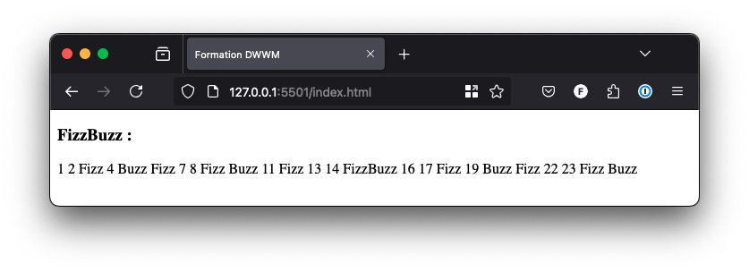

# Boucles

Une boucle est utilisée en programmation pour répéter un bout de code un certain nombre de fois ou bien jusqu'à ce qu'une ou plusieurs conditions soient satisfaites.

Par exemple, pour afficher une liste de courses, le programme va répéter la même opération sur chaque élément de la liste en les traitant un par un, à la suite.

Il existe deux façons de faire une boucle en JavaScript :

- `while` : effectue des opérations tant qu'une condition n'est pas remplie.

- `for` : permet de répéter un traitement un nombre défini de fois.


## 1\. while

La boucle `while` permet de répéter un traitement tant qu'une condition n'est pas satisfaite.

### a. Syntaxe

Sa syntaxe est particulièrement simple étant donné qu'elle est quasiment littérale :

```js
// Tant que la condition n'est pas remplie : 
while (condition) {
  // Le programme effectue une ou plusieurs opérations
  operations;
}
```

La condition peut être de n'importe quelle forme, mais elle doit absolument retourner un booléen. La boucle repart pour un tour tant que la condition est évaluée à vrai.

### b. Vers l'infini et au-delà

La boucle infinie est l'ennemi du développeur. Et elle peut parfois prendre des formes sournoises.

```js
let i = 0;
// /!\ Cette boucle est une boucle infinie
while (i < 2) {
  i = i++;
}
```

Pour rappel, `i++` est la valeur de `i` avant l'incrémentation alors que `++i` est celle d'après. La valeur de `i` reste donc à 0 et les multiples itérations n'y changeront rien.

### c. Exemple

Imaginons que la NASA développe un compte à rebours en JavaScript pour le lancement d'une nouvelle fusée dans l'espace.

```html
<!DOCTYPE html>
<html lang="fr">
  <head>
    <meta charset="UTF-8" />
    <title>Formation DWWM</title>
  </head>
  <body>
    <script>
      // Boucles
      document.writeln('<h3>Boucles : </h3>');
      // Déclaration du nombre de secondes
      let lancement = 5;
      // Tant que le nombre de secondes est positif :
      while (lancement >= 0) {
        document.writeln('Décompte : ' + lancement + '<br />');
        lancement--;
      }
      document.writeln('Houston … lancement réussi !!');
    </script>
  </body>
</html>
```

### d. Version alternative

Parfois, il peut être utile d'évaluer la condition après avoir effectué un passage dans le bloc d'instructions. On ne peut décemment pas demander à l'utilisateur son choix avant de lui avoir présenté le menu.

Dans ce cas précis, cette syntaxe est plus élégante et permet de ne pas dupliquer de code.

```html
<!DOCTYPE html>
<html lang="fr">
  <head>
    <meta charset="UTF-8" />
    <title>ENI Éditions</title>
  </head>
  <body>
    <script>
      // Do while
      document.writeln('<h4>Do ... while : </h4>');
      let choix;
      do {
        console.log('Formules :');
        console.log('\n1-entrée/plat/dessert');
        console.log('\n2-entrée/plat');
        console.log('\n0-quitter');
        choix = prompt('\nQuel est ton choix ? ');
      } while (choix != 0);
    </script>
  </body>
</html>
```

## 2\. for

Contrairement à la boucle `while`, la boucle `for` est utilisée lorsque le développeur souhaite itérer un nombre précis de fois.

Pour arriver à ses fins, une variable, souvent appelée `i`, est utilisée. Elle doit être déclarée et initialisée dans l'en-tête de la déclaration et n'existe que le temps des itérations.

### a. Syntaxe

```js
for (initialisation; condition; opération de fin de bloc) {
  opération(s);
}
```

La déclaration et l'initialisation ne sont pas obligatoires, mais les bonnes pratiques conseillent la création et l'utilisation d'une variable exclusive afin de ne pas interférer avec une autre variable globale du même nom dans le programme.

Il est tout à fait possible d'initialiser, de tester et d'effectuer des opérations de fin de bloc sur plusieurs variables.

> Dans la plupart des cas, l'opération de fin de bloc est une incrémentation.

```js
for (initialisation1, initialisation2; condition1, condition2, opé
fin de bloc 1, opé fin de bloc 2) {
  opération(s);
}
```

### b. FizzBuzz

FizzBuzz est un test très connu qui permet aux recruteurs de vérifier les aptitudes techniques d'un développeur pendant un entretien d'embauche. Il permet de démasquer les imposteurs très facilement.

Il s'agit d'écrire un programme qui affiche les nombres de 01 à 25. Pour les multiples de 3, le programme affiche "fizz" à la place. Pour les multiples de 5, il affiche "buzz".

```html
<!DOCTYPE html>
<html lang="fr">
  <head>
    <meta charset="UTF-8" />
    <title>Formation DWWM</title>
  </head>
  <body>
    <script>
      // FizzBuzz
      document.writeln('<h3>FizzBuzz : </h3>');
      // Déclaration de la variable
      let affichage;
      // Pour chaque chiffre de 1 à 25 inclus :
      for (var i = 1; i <= 25; i++) {
        // Initialisation de la variable à vide
        affichage = '';
        // Si i est un multiple de 3 :
        if (i % 3 == 0) {
          affichage += 'Fizz';
        }
        // Si i est un multiple de 5 :
        // Si i est un multiple de 3 et de 5, la valeur d'affichage est 'FizzBuzz'
        if (i % 5 == 0) {
          affichage += 'Buzz';
        }
        // Si i n'est ni un multiple ni de 3 ni un multiple de 5, on affecte la valeur de i à affichage
        if (affichage == '') {
          affichage += i;
        }
        document.writeln(affichage);
      }
    </script>
  </body>
</html>
```

> Avec de l'expérience, ce problème peut être résolu en une seule ligne :
> ```js
> for(i=1;i<=25;i++){console.log((i%3?'':'Fizz')+(i%5?'':'Buzz')||i)}
> ```



### c. Optimisation pour les indices de listes et d'objets

Une liste ou un objet contient un nombre fini d'éléments. JavaScript connaît précisément ce nombre et permet de simplifier considérablement la boucle for pour afficher les indices de ces éléments.

```js
let leDinerDeCons = {
  'brochant': 'Thierry Lhermitte',
  'pignon': 'Jacques Villeret',
  'leblanc': 'Francis Huster',
  'cheval': 'Daniel Prévost'
}

for (nomFictif in leDinerDeCons) {
  console.log(nomFictif);
}
```

Même si ce type de boucle semble plus simple à mettre en place, elle ne permet pas l'itération des valeurs de la liste et est déconseillée pour les tableaux. En effet, la boucle `for` classique est compatible avec tous les navigateurs et offre de meilleures performances.
