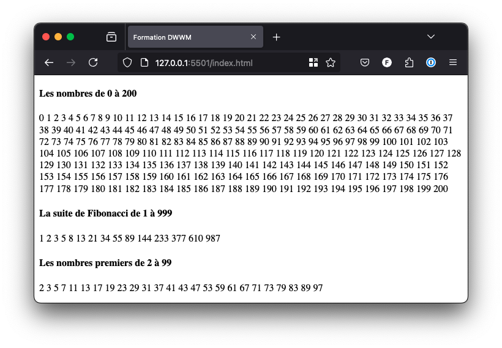

# Mise en pratique

## Énoncé

Réalisez l’affichage des nombres de 0 à 200.

Réalisez l’affichage de la suite de Fibonacci jusqu’au nombre 999. Dans celle-ci, chaque nombre est la somme des deux précédents (1, 1, 2, 3, 5, 8…).

Réalisez l’affichage des nombres premiers compris entre 2 et 99. Pour rappel, un nombre premier est un nombre divisible uniquement par lui-même et 1.

_Résultat attendu de la mise en pratique_
